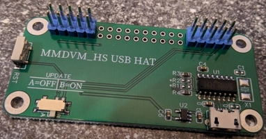
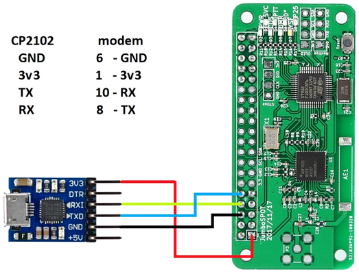

# no-pi-spot
This project goal is to provide an easy start with running your MMDVM hotspot without Raspberry Pi when connected directly to your computer via usb2serial adapter. It contains precompiled MMDVMHost related binaries along with minimal configuration templates.

## Requirements
* x86_64 architecture PC with modern 64bit Linux OS.
* MMDVM Hat, either Simplex or Duplex one.
* usb2serial adapter, which connects the MMDVM Hat to PC: a special one or a cheap CP2102 based stick. Both will work and are available on Aliexpress.

## How to
* Clone this repository.
* Open a Terminal app.  
* Enter the `no-pi-spot` directory
* Edit the `config/dmr-direct/MMDVM.ini` configuration file according to your identification. 
* Run `./bin/MMDVMHost config/dmr-direct/MMDVM.ini` — your hotspot will then be accessible on 439.800 MHz frequency, CC1, TS2.

## ToDo
* Docker support.
* Multiple templates for different modes, not just direct DMR connection.
* A simple dashboard.
* You name it :)
